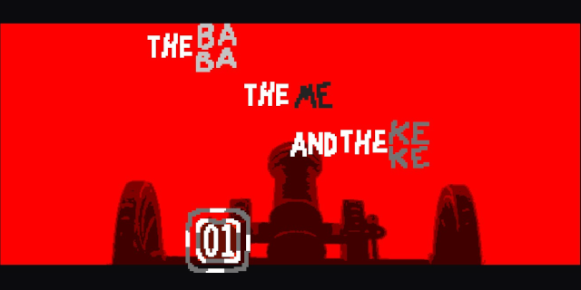

## The Baba, the Me and the Keke
This is a custom level pack for [Baba is You](https://hempuli.com/baba/).

Heavily inspired by [The Good, The Bad and The Ugly](https://en.wikipedia.org/wiki/The_Good,_the_Bad_and_the_Ugly), and westerns in general.

Currently a work in progress; released for playtesting / feedback.

Includes:

* 12 puffs, 4 blossoms, no bonuses
* Custom music track
* Custom word (shoot: fall in current facing direction)

See [REFERENCES](REFERENCES.md) for a partial list of assets and references (with minor spoilers).

### Installing

- Download the latest release from this repository: [link](https://github.com/someusername6/the-baba-the-me-and-the-keke/archive/master.zip)
- Extract in its own directory to `[...]/Baba Is You/Data/Worlds/`.

Alternatively, [clone the repository](https://docs.github.com/en/github/creating-cloning-and-archiving-repositories/cloning-a-repository)
and pull new updates when necessary.

Custom levels and level editor must be enabled.

### Playtesters

Thanks to the following discord users for early feedback:

- JustWhy?
- hutthutthutt
- hillexed
- Mrnoob

### Changelog
- 0.1.0
  - Renamed level IDs: saves from previous versions may not be compatible.
  - Added 6 new levels.
  - Added title screen and assigned levels to areas.
  - Updated palette border color to black.
- 0.0.4
  - Remove one unintended counterfeiting solution in "Gun Assembly".
  - Minor aesthetic updates in a few levels.
  - Added playtester's list to README.
- 0.0.3
  - Added 3 new levels.
  - Updated map to open all initial 3 levels.
  - Updated visibility in existing levels.
- 0.0.2
  - Made rule-to-be-completed more explicit in "The Baba".
  - Updated line disappearing logic in "The Baba".
  - Better visibility on fofo words (gray and blue).
  - Updated "The Keke": keke near cowfo is now defeat, helping guide to the solution.
- 0.0.1
  - Proof of concept release.
